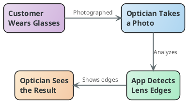
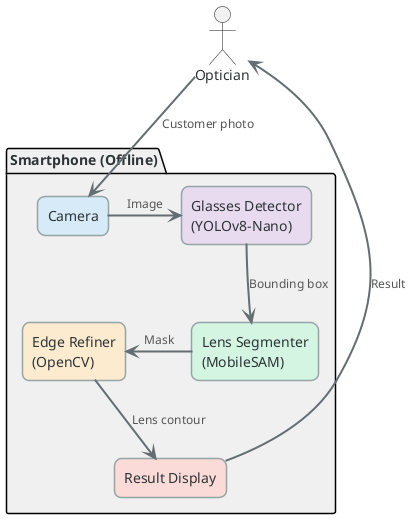

# AI-Powered Eyeglass Lens Edge Detection

---

## 1. Project Definition

A smartphone app for opticians that detects the precise lens edges of eyeglasses from a single photo. It combines deep learning models with digital image processing techniques (edge detection, morphological operations, contour analysis) to accurately find where each lens meets the frame. The optician photographs the customer and instantly sees the result — fully offline, no internet needed.

*(Figure 1: Conceptual overview showing user input, on-device processing, and visual output)*

---

## 2. Project Design

The system runs entirely on the smartphone with no server or internet dependency. It follows a three-stage pipeline: first, a lightweight object detector (YOLOv8-Nano) locates the glasses in the photo; then, a mobile segmentation model (MobileSAM) isolates the frame and lens regions; finally, classical image processing algorithms (Canny edge detection, contour analysis) extract the precise lens boundary. The diagram below illustrates these five components and the data flowing between them.

### System Architecture

### Data Flow
1. **Input:** Optician captures a photo of the customer wearing glasses via the app camera.
2. **Detection:** A small object detection model locates the glasses on the customer's face.
3. **Segmentation:** MobileSAM generates a precise mask of the frame using the detected location.
4. **Refinement:** Classical computer vision algorithms extract the exact inner lens edge from the mask.
5. **Output:** The final lens contour is displayed to the optician in real-time.

---

## 3. Project Requirements

### Software
- **Mobile Framework:** React Native / Expo (for cross-platform app development)
- **AI Inference:** ONNX Runtime Mobile / TensorFlow Lite (to run models on-device)
- **Computer Vision:** OpenCV Mobile (for image processing algorithms)
- **Models:** MobileSAM (Segment Anything Model), YOLOv8-Nano (for detection)

### Hardware
- **Development:** macOS/Linux workstation with GPU for model training/optimization.
- **Target Device:** Modern smartphone (iOS 15+ or Android 10+) with camera and NPU (Neural Processing Unit) support for fast inference.

### Other Resources
- **Dataset:** Proprietary dataset of 40+ high-resolution eyeglass images for testing.
- **Public Datasets:** Roboflow & Kaggle eyeglass datasets for model training.

---

## 4. Success Criteria

1. **Lens Detection ≥ 85%:** Given a photo of a customer wearing eyeglasses, the system must correctly detect and outline both lenses in at least 85 out of 100 images. *Test: Run the on-device pipeline on the test set and count successful detections.*

2. **On-Device Latency ≤ 3 seconds:** The total processing time (Detection + SAM + Refinement) must be under 3 seconds on a mid-range smartphone. *Test: Measure end-to-end inference time on a physical device (e.g., iPhone 13).*

3. **Works Offline:** The app must function 100% without an internet connection, usable in any optical shop. *Test: Enable airplane mode and verify that the entire pipeline (photo to result) works without errors.*

---

## 5. Project Timeline

| Month | Task | Deliverable |
| :--- | :--- | :--- |
| **Month 1** | Research & Model Selection (MobileSAM vs SAM 2 Tiny) | Performance Benchmark Report |
| **Month 2** | Desktop Pipeline Development (Simulating Mobile Constraints) | Working Python Prototype |
| **Month 3** | Convert Models for Mobile (ONNX export, quantization, size & speed testing) | Optimized lightweight models ready for smartphone |
| **Month 4** | Mobile App Development (React Native + ONNX Runtime) | Alpha App with Camera |
| **Month 5** | Integration (Connecting Detector -> SAM -> OpenCV on Mobile) | Beta App (Full Pipeline) |
| **Month 6** | Performance Tuning & UI Polish | Release Candidate (RC) |

---

## 6. References

1. Ravi, N. et al. — *SAM 2: Segment Anything in Images and Videos.* Meta FAIR, 2024. [github.com/facebookresearch/sam2](https://github.com/facebookresearch/sam2)
2. Zhang, C. et al. — *MobileSAM: Lightweight Segment Anything Model.* 2023. [github.com/ChaoningZhang/MobileSAM](https://github.com/ChaoningZhang/MobileSAM)
3. ONNX Runtime — *Cross-platform, high performance ML inference.* [onnxruntime.ai](https://onnxruntime.ai)
4. Canny, J. — *A Computational Approach to Edge Detection.* IEEE TPAMI, 1986.
5. React Native — *Cross-platform mobile framework.* [reactnative.dev](https://reactnative.dev)
